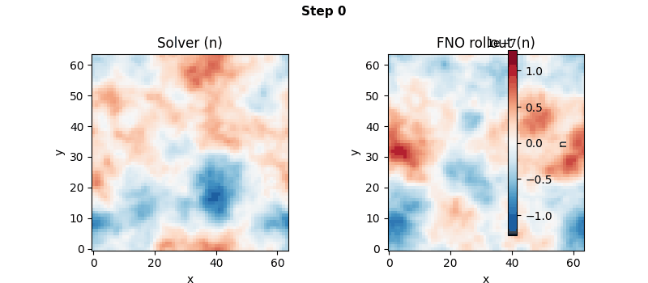
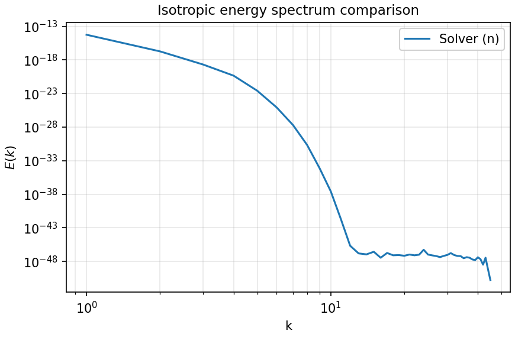

# DriftWave-Lab

**A research-grade open-source laboratory for 2D drift-wave plasma turbulence, ML surrogates, and inverse scientific machine learning.**

> Pseudo-spectral Hasegawa–Wakatani solver · Fourier Neural Operator & U-Net surrogates · PINN-based parameter inference

<p align="center">
  
</p>

<p align="center">
  <em>Left: pseudo-spectral HW solver ground truth — Right: FNO surrogate autoregressive rollout</em>
</p>

<p align="center">
  <a href="#visual-assets">spectra</a> · <a href="#visual-assets">benchmark</a> · <a href="#visual-assets">error analysis</a>
</p>

---

## What is this?

DriftWave-Lab is a self-contained computational laboratory that combines:

1. A **pseudo-spectral numerical solver** for the 2D Hasegawa–Wakatani (HW) equations on a doubly periodic domain.
2. **Machine-learning surrogate models** (CNN/U-Net baseline and Fourier Neural Operator) trained on solver-generated turbulence data.
3. An optional **physics-informed inverse track** for recovering PDE parameters from sparse or noisy observations.

The goal is to provide a compact but serious platform for studying drift-wave turbulence dynamics with modern scientific ML methods — physically motivated, numerically grounded, visually compelling, and structured like production-grade research software.

## Scientific motivation

The edge and scrape-off-layer regions of magnetized plasmas exhibit strongly nonlinear turbulence driven by drift-wave instabilities. The **Hasegawa–Wakatani equations** are a widely used reduced model for resistive drift-wave turbulence, capturing:

- drift-wave instability and saturation,
- nonlinear E×B advection,
- zonal-flow self-organisation,
- anomalous cross-field transport,
- rich spectral and statistical structure.

HW sits in an ideal complexity regime: much richer than toy PDEs (Burgers, heat equation), yet far cheaper and more self-contained than full gyrokinetics. The resulting turbulent fields — with coherent vortices, filamentary structures, and broadband spectra — make an excellent testbed for neural-operator surrogates and physics-informed inverse methods.

For the full scientific and technical specification, see [`PROJECT_SPEC.md`](PROJECT_SPEC.md).

## Roadmap

| Phase | Objective | Status |
|-------|-----------|--------|
| **0** | Repository scaffold, CI, dev tooling | ✅ Done |
| **1** | Pseudo-spectral HW solver MVP | ✅ Done |
| **2** | Parameterised multi-trajectory dataset generation | ✅ Done |
| **3** | CNN / U-Net baseline surrogate | ✅ Done |
| **4** | FNO 2D hero model + benchmarking | ✅ Done |
| **5** | Visual assets, README polish, presentation layer | ✅ Done |
| **6** | PINN / inverse parameter-estimation track | 🔲 Planned |

## Architecture

```text
src/driftwave_lab/
├── solver/            # Pseudo-spectral HW solver, diagnostics, ICs
├── data/              # Dataset generation, I/O, PyTorch wrappers
├── models/            # U-Net, FNO 2D, PINN inverse
├── training/          # Training loops (baseline, FNO, PINN)
├── evaluation/        # Rollout, metrics, benchmarks, spectral analysis
├── viz/               # Plots, GIFs, README asset generation
└── utils/             # Config loading, reproducibility helpers

scripts/               # CLI entry points (solver, dataset, train, …)
configs/               # YAML configuration templates
tests/                 # Smoke and unit tests
assets/                # README visual assets (GIFs, plots)
docs/                  # Technical documentation
```

## Visual assets

All figures and animations below are generated reproducibly by a single command (see [Generate visual assets](#generate-visual-assets)).

| | |
|:---:|:---:|
|  |  |
| *Energy spectra — solver vs ML surrogates* | *Inference speedup over the spectral solver* |

<details>
<summary><strong>More: rollout error & comparison panels</strong></summary>

<p align="center">
  
</p>

| | |
|:---:|:---:|
|  |  |
| *MSE & relative L2 vs rollout horizon* | *Truth / Prediction / Error panel* |

</details>

> **Note:** If no ML checkpoints are available, the script runs in *solver-only mode* —
> `hero.gif` shows two solver realisations with different seeds, and spectra/benchmark
> are omitted.

## Quickstart

```bash
# Clone the repository
git clone https://github.com/davidgisbertortiz-arch/driftwave-lab.git
cd driftwave-lab

# Create a virtual environment (recommended)
python -m venv .venv
source .venv/bin/activate

# Editable install with development dependencies
pip install -e ".[dev]"

# Verify everything works
make check          # or: ruff check . && ruff format --check . && pytest
```

### Run the HW solver

```bash
# Default run (128×128, 4000 steps) — takes ~1-2 min
python scripts/run_solver.py

# Quick smoke run (32×32, 100 steps)
python scripts/run_solver.py --config configs/solver_tiny.yaml
```

Outputs (NPZ trajectory + snapshot PNG) are written to `outputs/`.
See [`docs/hw_equations.md`](docs/hw_equations.md) for the implemented equations.

### Generate a training dataset

```bash
python scripts/generate_dataset.py --config configs/dataset_tiny.yaml
```

### Train an ML surrogate

```bash
# Install ML dependencies
pip install -e ".[ml]"

# FNO hero model (requires dataset in data/raw/)
python scripts/train.py --config configs/train_fno.yaml

# U-Net baseline
python scripts/train.py --config configs/train_unet.yaml
```

### Autoregressive rollout

```bash
python scripts/rollout_demo.py \
    --checkpoint checkpoints/fno2d_best.pt \
    --steps 30
```

### Runtime benchmark

```bash
python scripts/benchmark.py --checkpoint checkpoints/fno2d_best.pt
```

See [`docs/fno_model.md`](docs/fno_model.md) for full ML pipeline documentation.

### Generate visual assets

```bash
# Solver-only mode (always works, no ML required)
python scripts/make_readme_assets.py

# With a custom config (e.g. higher resolution)
python scripts/make_readme_assets.py --config configs/assets.yaml
```

Generated files are written to `assets/`.  To get the full ML-comparison
figures (including `spectra.png` and `benchmark.png`), first train a model
(see [Train an ML surrogate](#train-an-ml-surrogate)) so that checkpoint
files exist under `checkpoints/`.

### Requirements

- Python ≥ 3.11
- Core: NumPy, PyYAML, Matplotlib
- ML (optional): PyTorch ≥ 2.0 (`pip install -e ".[ml]"`)

## Running checks

```bash
ruff check .              # lint
ruff format --check .     # format check
pytest                    # tests
make check                # all of the above
```

## Contributing

See [`CONTRIBUTING.md`](CONTRIBUTING.md) for development setup and workflow guidelines.

## References

Key references underpinning this project:

1. Hasegawa & Wakatani (1983). *Plasma Edge Turbulence.* Phys. Rev. Lett. **50**, 682.
2. Li et al. (2021). *Fourier Neural Operator for Parametric PDEs.* ICLR.
3. Raissi, Perdikaris & Karniadakis (2019). *Physics-informed neural networks.* J. Comput. Phys. **378**, 686.
4. Gahr, Farcas & Jenko (2024). *SciML-based reduced-order models for plasma turbulence.* Phys. Plasmas **31**, 113904.

See [`PROJECT_SPEC.md`](PROJECT_SPEC.md) § 14 for the complete reference list.

## License

[MIT](LICENSE)
